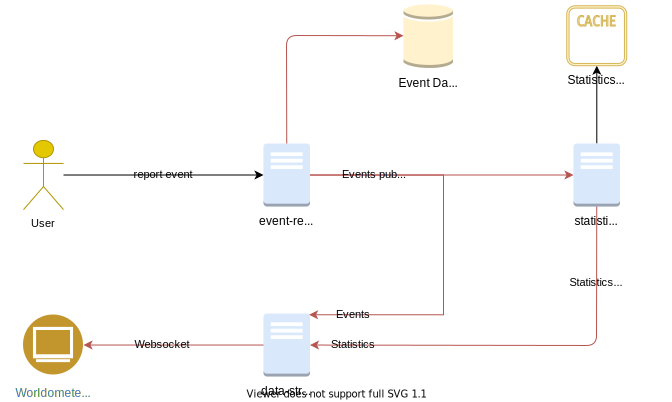

# World-o-Meter Clone for Corona Pandemic

This application show that statistics on number of things. These statics are calculated from the events coming from all over the globe. 
Scope of this application can be fairly big similar to original [worldometers](https://www.worldometers.info) website. But for the simplicity sake currently this Application only focus on Corona Virus Pandemic.

In 2019/2020 world was hit by [Corona Virus Pandemic](https://en.wikipedia.org/wiki/Coronavirus). For this [worldometers](https://www.worldometers.info) currently show statics about the new case, death and recoveries.

## Features

This App ingest events from different sources and show statics about below cases :
1. World's total reported Corona Virus cases
2. World's total Corona Virus death cases
3. World's total Corona Virus recovered cases
4. Specific Country's total reported Corona Virus cases
5. Specific Country's total Corona Virus death cases
6. Specific Country's Corona Virus recovered cases
4. Specific City's total reported Corona Virus cases
5. Specific City's total Corona Virus death cases
6. Specific City's Corona Virus recovered cases

App currently also show the stream of events.

## Technical Features

This Application demonstrate features of Even Driven Architecture similar to CQRS. Where state of an entity is dynamic and depend upon the events associated with the entity.
In this Architecture events are ingested by event-registration service and after persistence, events are published on Redis topics. Different consumers consume these events and process the events differently.

Below diagram explains the architecture in a better way.

