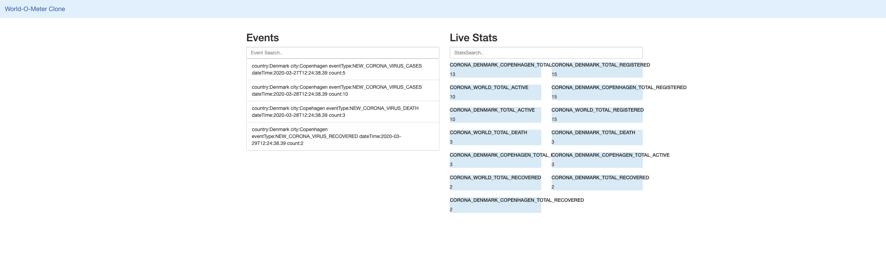

# World-o-Meter Clone for Corona Pandemic

This application show the statistics on number of things. These statistics are calculated from the events coming from all over the globe. 
Scope of this application can be fairly big, similar to original [worldometers](https://www.worldometers.info) website. But for the simplicity sake, currently this Application only focus on Corona Virus Pandemic.

In 2019/2020 World was hit by [Corona Virus Pandemic](https://en.wikipedia.org/wiki/Coronavirus). For this [worldometers](https://www.worldometers.info) currently show statics about the new case, death and recoveries.
This application try to implement similar functionality.

## Features

This App can ingest events from different sources and show statics about below cases :
1. World's total reported Corona Virus cases
2. World's total Corona Virus death cases
3. World's total Corona Virus recovered cases
4. Specific Country's total reported Corona Virus cases
5. Specific Country's total Corona Virus death cases
6. Specific Country's Corona Virus recovered cases
4. Specific City's total reported Corona Virus cases
5. Specific City's total Corona Virus death cases
6. Specific City's Corona Virus recovered cases

App also shows the stream of incoming events.

## Technical Features

This application demonstrate the features of Even Driven Architecture similar to CQRS. Where state of an entity is dynamic and depend upon the events associated with the entity.
In this architecture events are ingested by event-registration service and after persistence, events are published on Redis topics. Different consumers consume these events and process the events differently.

Below diagram explains the architecture in a better way.


This Application consist of 6 main parts
1. Event registration Service
2. Statistics Calculator Service
3. Data Streaming Service
4. World-o-meter clone website
5. Event Database
6. Redis for Pub/Sub and Cache Store

### Event registration Service

User can register a new event using this service. Service take [EventType](https://github.com/bhanuchaddha/world-o-meter-clone/blob/master/even-registration/src/main/java/com/bhanuchaddha/worldometerclone/datastreaming/model/EventType.java) as a parameter, which is used later to decide, how to handle the Event.
Service store the events in Mongo DB and after that publish the event on Redis `events` topic.

This service is also used to initialise in-memory MongoDb and Redis instance which would be used by all the services.

### Statistics Calculator Service
This service is used to calculate different statistics for each event. This service listen to all the event on the `events` topic and create or update the statistics.
After calculating the statistics, it keep the statistics on the Redis cache. We can enable the persistence for these caches if needed. 

These cache works as the `View` or `State` of entities in our Event driven Architecture.

This service is also responsible for publishing these statistics on `statistics` topic of Redis.

### Data Streaming Service
Data Streaming Service is responsible for all the streaming requirement in our architecture. This service listen to various topics and expose the messages to [WebSocket](
https://developer.mozilla.org/en-US/docs/Web/API/WebSockets_API). 

> The WebSocket API is an advanced technology that makes it possible to open a two-way interactive communication session between the user's browser and a server

### World-o-meter clone website
This is simple Single Page Application which shows all the live data about the events and statistics.

## Running the Application
Start the Spring boot application in below sequence:
1. event-registration
2. statistics-calculator
3. data-streaming

Now if you open the `localhost:8083/intdex.html` you should see the page like below: 


Lets create few events now. Execute below rest calls :

```shell script

curl --location --request POST 'localhost:8080/event' \
--header 'Content-Type: application/json' \
--data-raw '{
	"country":"Denmark",
	"city":"Copenhagen",
	"eventType":"NEW_CORONA_VIRUS_CASES",
	"dateTime": "2020-03-27T12:24:38.39",
	"count": 5
}'

curl --location --request POST 'localhost:8080/event' \
--header 'Content-Type: application/json' \
--data-raw '{
	"country":"Denmark",
	"city":"Copenhagen",
	"eventType":"NEW_CORONA_VIRUS_CASES",
	"dateTime": "2020-03-28T12:24:38.39",
	"count": 10
}'

curl --location --request POST 'localhost:8080/event' \
--header 'Content-Type: application/json' \
--data-raw '{
	"country":"Denmark",
	"city":"Copehagen",
	"eventType":"NEW_CORONA_VIRUS_DEATH",
	"dateTime": "2020-03-28T12:24:38.39",
	"count": 3
}'

curl --location --request POST 'localhost:8080/event' \
--header 'Content-Type: application/json' \
--data-raw '{
	"country":"Denmark",
	"city":"Copenhagen",
	"eventType":"NEW_CORONA_VIRUS_RECOVERED",
	"dateTime": "2020-03-29T12:24:38.39",
	"count": 2
}'
```

Now if you open the website, you must see events and statistics on the page.



## Technical Features
* Easily navigable service package structure.
* Separation of concern using 3 layer architecture (Resource, Service, Persistence)
* Using separate models for Presentation(DTO) and Internal(entity) usage.
* API testing with `RestAssured`.
* Builder Pattern is used to create immutable objects. Setters are used where ever necessary like for JPA and Marshaling/Unmarshaling.
* Separate Service is used for each used-case to enable Single Responsibility Principle.
* Each Service has its own well defined input and output contacts to implement Encapsulation.

## Further Improvements
* Java Docs
* MapStruct could be used for mappers.
* Null checks and mandatory value validation.
* Logging
* Validation
* Stats should not be decremented to negative value.
* All the stats are published to all the users, User should be able to ask for selected stats
* Stats could be persisted.
* Currently only live stats is available to customer. Design can be extended to serve static stats data
* Detailed API tests

## Technology Used
* Spring Boot
* Java 8 - streams
* JPA
* Lombok
* Mongo db in-memory db
* Redis in-memory
* RestAssured
* WebSockets 

## API Testing
API test are available at `statisticscalculator.StatsTest` . More API test can be added.